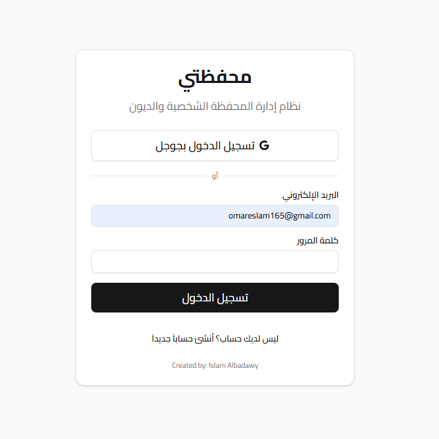
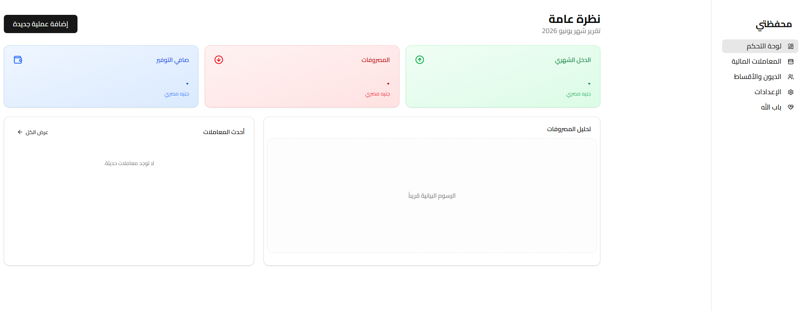
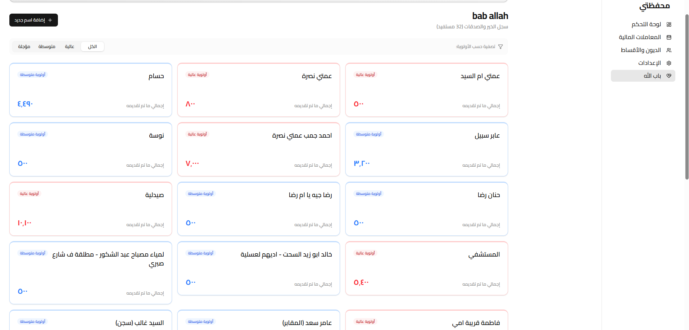

# Personal Finance Tracker

A personal finance web application for tracking debts, daily expenses, income, accounts and financial records.

This project was created as a practical learning project to improve my skills in modern web development, especially **TypeScript**, **Next.js**, **Firebase** and building structured user interfaces.

---

## Project Overview

Personal Finance Tracker helps users organize their financial data in one place.
The application includes tools for managing transactions, debts, accounts and categories, with automatic financial calculations and a responsive interface.

The main goal of this project was to build a real-world web application while practicing TypeScript and learning how frontend, authentication and database features work together.

---

## Features

* User authentication with Email/Password and Google Sign-in
* Dashboard with financial overview
* Track income, expenses and transfers
* Manage debts and loans
* Payment tracking for debts
* Customizable categories
* Account management such as wallet or bank account
* Filter and organize financial records
* Automatic total calculations
* Export transaction history as CSV
* Responsive design for desktop and mobile

---

## Skills Practiced

Through this project, I practiced:

* Learning and using TypeScript in a real project
* Building a web application with Next.js
* Working with Firebase Authentication
* Storing and reading data from Firestore
* Creating reusable UI components
* Managing forms and user input
* Handling financial calculations
* Structuring a frontend project
* Improving responsive design
* Organizing code for a practical application

---

## Technologies Used

* TypeScript
* Next.js
* React
* Firebase Authentication
* Firestore Database
* Tailwind CSS
* JavaScript
* HTML
* CSS

---

## Installation

Clone the repository:

```bash
git clone https://github.com/IslamAbouelregal/Personal-finance-tracker.git
cd Personal-finance-tracker
```

## Project Structure

```text
Personal-finance-tracker/
│
├── public/
├── src/
│   ├── app/
│   ├── components/
│   ├── lib/
│   └── types/
│
├── README.md
├── package.json
├── next.config.ts
├── tsconfig.json
└── tailwind.config.ts
```

---

## Screenshots




---

Example:

```md

```

---

## What I Learned

This project helped me understand how to build a practical finance management application using modern web technologies.

I practiced TypeScript step by step while working on real features such as authentication, data storage, forms, filtering, calculations and responsive UI design.

It also helped me understand how important clean structure and data security are when building applications that manage personal information.

---

## Future Improvements

* Improve UI design
* Add charts for monthly financial overview
* Add more advanced filtering
* Add dark mode
* Add better form validation
* Add tests
* Improve TypeScript types and code structure
* Add more detailed reports

---

## Author

**Islam Albadawy**
Aspiring Software Developer 
